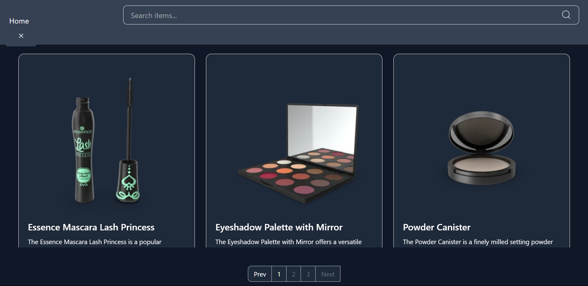
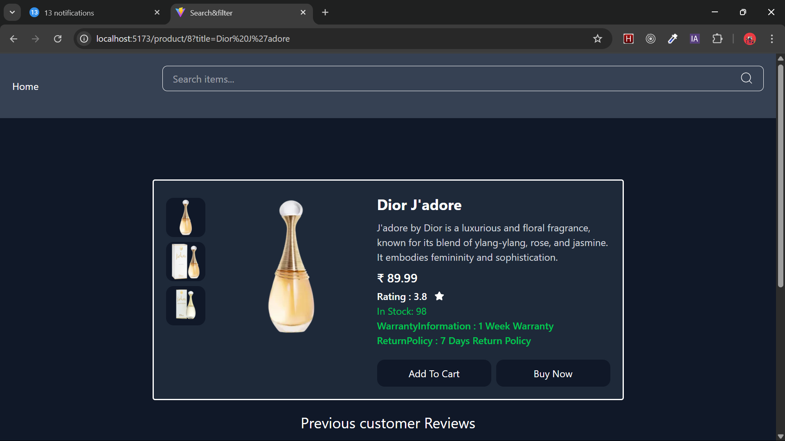

# React Search & Filter with Context API and useLocation

 A dynamic search and filter system built with React, Tailwind CSS, and React Router’s `useLocation`. This project demonstrates how to handle URL query parameters for filtering and managing global state efficiently using Context API.

---

## 🖼️ Project Screenshot




## 🚀 Live Demo  
[View Live Project Here](https://searchfilter-phi.vercel.app/)  

---

## 🧩 Features

- 🔍 Dynamic search bar filtering products by name  
- 🗂️ Multi-category filtering with React Context API  
- 🎨 Responsive and clean UI powered by Tailwind CSS  
- 🔗 URL query parameters handled via React Router’s `useLocation` and `URLSearchParams`  
- 💡 Props drilling minimized using Context API for scalable state management  
- 🔧 API-friendly search logic with `encodeURIComponent` to safely encode search queries  

---

## 🛠️ Technologies Used

- React.js (Functional Components, Hooks)  
- React Router DOM (`useLocation`)  
- Context API for global state management  
- Tailwind CSS for styling  
- JavaScript (ES6+)  

---

##  What I Learned

- How to parse and use URL search parameters (`useLocation` + `URLSearchParams`)  
- Benefits of using Context API vs props drilling in React  
- Safe URL encoding with `encodeURIComponent` to handle special characters in queries  
- How to build reusable and scalable search/filter components  
- Integrating frontend search logic with potential backend APIs  

---

## 💡 How to Run Locally

1. Clone the repository  
   ```bash
   git clone https://github.com/joni7679/searchfilter
   cd searchfilter
   npm i 
   npm run dev
